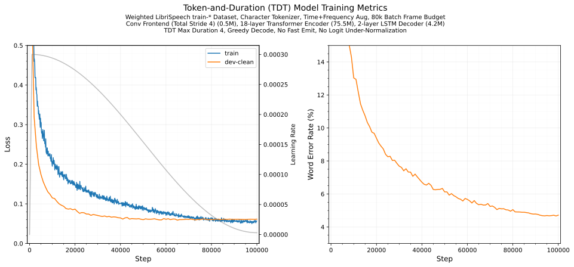

# ASR

An experimental repo to play around with automatic speech recognition (ASR) papers and ideas.

- [Usage](#usage)
  - [CTC](#ctc)
  - [RNN-T](#rnn-t)
  - [TDT](#tdt)
  - [BPE](#bpe)
- [Features](#features)
  - [Loss](#loss)
  - [Architecture](#architecture)
  - [Tokenizer](#tokenizer)
  - [Dataset](#dataset)
  - [Data Normalization](#data-normalization)
  - [Data Augmentation](#data-augmentation)
  - [Data Batching](#data-batching)
  - [Logging](#logging)
- [Example Training](#example-training)
  - [TDT](#tdt-1)

## Usage

Training is driven by [Hydra](https://hydra.cc/docs/intro/).

Reusable building blocks and system configs live under [`src/asr/conf/`](src/asr/conf). A training run requires selecting a system config (`system=ctc` / `system=rnnt`, which bundles the model components and loss), the data configs, and the remaining per-run settings via the command line. 

The command line permits config file settings to be overridden and, if necessary, a full training run to be configured (although it's verbose!).

### CTC

```
uv run train \
    dataset=ls960 augment=speed_specaug dataloader=bucket \
    eval_dataset=dev_clean eval_dataloader=dev \
    system=ctc \
    tokenizer=char 'tokenizer.specials=["<blank>"]' \
    total_steps=10_000 eval_every=500 optim.lr=0.0003 max_grad_norm=2.0 \
    device="cuda:1" logger=tqdm
```

### RNN-T

```
uv run train \
    dataset=ls960 augment=speed_specaug dataloader=bucket \
    eval_dataset=dev_clean eval_dataloader=dev \
    system=rnnt \
    tokenizer=char 'tokenizer.specials=["<blank>", "<sos>"]' \
    total_steps=10_000 eval_every=500 optim.lr=0.0003 max_grad_norm=2.0 \
    device="cuda:1" logger=tqdm
```

### TDT

```
uv run train \
    dataset=ls960 augment=speed_specaug dataloader=bucket \
    eval_dataset=dev_clean eval_dataloader=dev \
    system=tdt \
    tokenizer=char 'tokenizer.specials=["<blank>", "<sos>"]' \
    total_steps=10_000 eval_every=500 optim.lr=0.0003 max_grad_norm=2.0 \
    device="cuda:1" logger=tqdm
    # add system.loss.sigma=0.05 to bias toward longer durations
```

### BPE

The above usage examples use character-level tokenization. To switch to byte pair encoding (BPE) a model is required. This command generates one containing 1022 tokens so the tokenizer instance can add `<blank>` and `<sos>` symbols for the RNN-T and TDT losses bringing it to 1024 (power of 2). For CTC use 1023 and remove `<sos>` from the example training command below:

```
uv run train-bpe trainer.vocab_size=1022 output_dir=models/tokenizers/ls960_bpe1022/
```

Then train a speech recognition model as per any of the commands above but switching the tokenizer line for:

```
...
    tokenizer=bpe tokenizer.model_dir=models/tokenizers/ls960_bpe1022 'tokenizer.specials=["<blank>", "<sos>"]' \
...
```

## Features

### Loss

- Connectionist Temporal Classification (CTC). [Paper](https://www.cs.toronto.edu/~graves/icml_2006.pdf). Implementation in [CUDA](src/asr/loss/csrc/ctc.cu) with PyTorch stable ABI [bindings](src/asr/loss/csrc/ctc_bindings.cpp).
- Transducer / RNN-T. [Paper](https://arxiv.org/abs/1211.3711). Implementation in [CUDA](src/asr/loss/csrc/rnnt.cu) with PyTorch stable ABI [bindings](src/asr/loss/csrc/rnnt_bindings.cpp).
- Token-and-Duration Transducer (TDT) with optimal logits under-normalization to bias towards longer durations. [Paper](https://arxiv.org/abs/2304.06795). Implementation in [CUDA](src/asr/loss/csrc/tdt.cu) with PyTorch stable ABI [bindings](src/asr/loss/csrc/tdt_bindings.cpp).

### Architecture

- Transformer (RoPE, SwiGLU, Prenorm). [Implementation](src/asr/model/transformer.py).
- LSTM stack. Wraps PyTorch, [implementation](src/asr/model/lstm.py).
- Conv subsampling frontend, [implementation](src/asr/model/encoder.py).

### Tokenizer

- Character. [Implementation](src/asr/data/tokenizer.py).
- Byte pair encoding (BPE), via [SentencePiece](https://github.com/google/sentencepiece). [Paper](https://arxiv.org/abs/1508.07909).

### Dataset

- LibriSpeech. [Website](https://www.openslr.org/12).

### Data Normalization

- "Global" normalization. Per-feature normalization using pre-computed per-feature mean and std.
- Per sample per feature normalization. Mean and std stats computed over the time dimension for each sample.

### Data Augmentation

- SpecAugment time and frequency masking. [Paper](https://arxiv.org/abs/1904.08779).
- Speed perturbation. [Paper](https://www.isca-archive.org/interspeech_2015/ko15_interspeech.html).

### Data Batching

- Dynamic length bucketing with a per-batch frame budget, inspired by [Lhotse](https://github.com/lhotse-speech/lhotse).

### Logging

- tqdm. [Website](https://github.com/tqdm/tqdm).
- Aim. [Website](https://github.com/aimhubio/aim).

## Example Training

### TDT

Small scale training, 32 hours on a single NVIDIA 3090:


